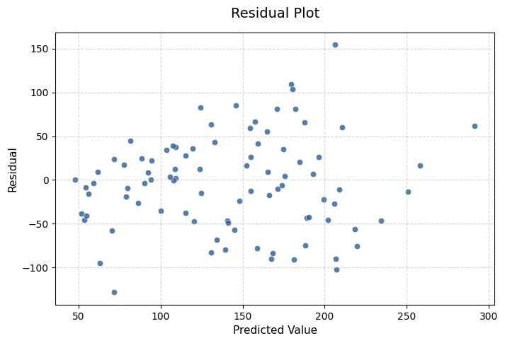

# Project 009 | Regression Evaluation Report

Started on July 16, 2026

Completed on July 16, 2026

## Problem Statement

Using the Diabetes dataset (or another regression dataset of your choice):

1. Train a LinearRegression model.
2. Compute:
   * MAE
   * MSE
   * RMSE
   * R²
3. Create a Residual Plot (Predicted values vs. Residuals).
4. Write a short report answering:
   * Are the residuals randomly scattered?
   * Do you observe any visible pattern?
   * Based on the residual plot, does Linear Regression appear to be an appropriate model for this dataset?
   * Which metric do you think communicates the model's performance most clearly, and why?

## Report

### Are the residuals randomly scattered?

Yes, they are.

### Do you observe any visible pattern?
No.

### Based on the residual plot, does Linear Regression appear to be an appropriate model for this dataset?
The condition of Homoscedasticity / Constant Variance is failed.

Observation: The vertical spread (variance) of the residuals is not constant. For lower predicted values (around 50 to 100), the points are clustered relatively close to 0. As the predicted values increase (around 150 to 220), the spread widens significantly, forming a slight funnel or megaphone shape.

Meaning: This indicates heteroscedasticity (non-constant variance).

So, based on the residual plot, Linear Regression does not appear to be an appropriate model for this dataset.

But it can be with appropriate modifications.

### Which metric do you think communicates the model's performance most clearly, and why?

RMSE (53.85) if we want a clear, real-world metric that honestly accounts for the larger errors visible in your residual plot.

We can pair it with the $R^2$ Score (0.45) to immediately communicate that the model currently explains less than half of the data's variance.

